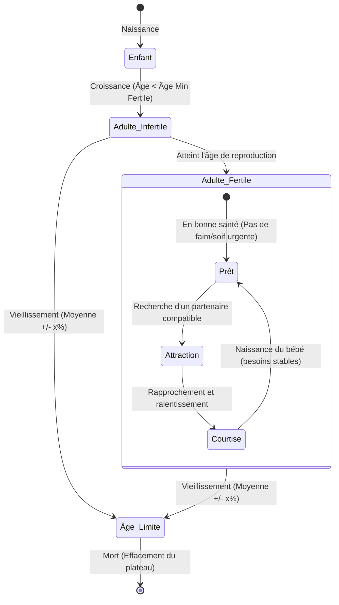

# Description du Concept de Jeu - Simulation de Population Spatiale 2D

Ce document sert de cahier des charges et de description pour le prototype de jeu de simulation d'individus en 2D avec rendu vue du dessus.

---

## 1. Vue d'ensemble du Plateau de Jeu

* **Espace de jeu :** Une zone carrée centrée à l'écran, dimensionnée pour s'adapter dynamiquement à la taille de la fenêtre (pas de défilement/scroll).
* **Affichage :** Rendu en HTML5 Canvas pour assurer la fluidité des mouvements et des interactions.
* **Phase d'initialisation :**
  * Avant le lancement de la simulation, un panneau de configuration permet de paramétrer les différents types d'individus.
  * Les points d'eau et spots de nourriture peuvent être positionnés visuellement en cliquant directement sur une **mini-carte interactive** (éditeur de ressources intégré). Ils peuvent également être supprimés facilement par un **clic droit** sur la mini-carte ou en utilisant le **Mode Gomme** de l'éditeur.
  * Au départ, les individus de chaque type apparaissent à proximité de leur point d'apparition (Spawn Point) spécifique configuré par type.
* **Contrôles de la simulation (En cours d'exécution) :**
  * L'utilisateur n'interagit pas directement avec les individus (observateur passif).
  * Il contrôle uniquement le flux temporel de la simulation : **Mettre en pause / Reprendre**, **Accélérer** (Avance rapide) et **Ralentir**.

---

## 2. Définition des Individus (Agents)

Chaque individu est modélisé visuellement par une forme géométrique simple vue du dessus (par exemple, un cercle) dont la couleur est déterminée par son **Type**.

### Paramètres par Type d'Individu (Configurables)
* **Couleur** : Identifiant visuel du type d'individu.
* **Vitesse de déplacement** : Vitesse standard à laquelle l'individu se déplace sur le plateau.
* **Durée de vie moyenne (Average Lifespan)** : Durée moyenne qu'un individu peut vivre.
* **Fluctuation de durée de vie** : Pourcentage de variation (+/- x%) appliqué à la naissance pour déterminer la durée de vie réelle.
* **Tendance au métissage** : Probabilité (0.0 à 1.0) pour un individu d'accepter un accouplement avec un partenaire de type/dialecte différent.
* **Point d'apparition (Spawn Point)** : Coordonnées (X, Y) de départ autour desquelles les individus de ce type naissent à l'initialisation.
* **Fenêtre de reproduction (Fertilité)** : Âge minimum et âge maximum durant lesquels l'individu est fertile.
* **Rayon de communication** : Distance maximale (en pixels) à laquelle l'individu peut parler avec d'autres.
* **Dialecte** : Dialecte parlé (chaîne de caractères ou identifiant).
* **Intelligence** : Niveau de base (influençant l'apprentissage, la vitesse de transmission et la capacité de déduction).

---

## 3. Cycle de Vie et Reproduction

La dynamique principale repose sur les interactions physiques et la démographie des individus :

### Mécanisme de Courtise, Métissage et Naissance
1. **Désir de Reproduction (Pas de Cooldown) :** Le désir de reproduction est permanent chez les individus fertiles (dans leur fenêtre d'âge et n'ayant pas subi de perte totale de fertilité). Cependant, ce désir est **préempté par d'autres besoins plus urgents** : chercher de la nourriture (faim), chercher de l'eau (soif), dormir (fatigue), ou fuir un danger.
2. **Détection et Métissage Génétique :** 
   * Deux individus fertiles et "prêts" (sans autre activité prioritaire) qui se croisent s'attirent mutuellement.
   * Le **métissage** (accouplement entre individus de caractéristiques différentes) est possible. La tendance à s'accoupler avec un individu de type différent est paramétrable au départ.
   * **Crossover de caractéristiques :** L'enfant n'hérite pas d'un type parent "tout fait". Pour chaque caractéristique (vitesse, intelligence, durée de vie moyenne, dialecte, couleur de type, etc.), l'enfant a 50% de chances d'hériter de celle du parent A, et 50% de celle du parent B. Il définit ainsi son propre profil hybride unique.
3. **Phase de rapprochement (Courtise) :**
   * Les deux individus restent proches/collés pendant une durée définie, se déplaçant très lentement.
4. **Naissance et Vieillissement :**
   * À la fin de la courtise, un nouvel individu naît à proximité. Sa durée de vie maximale réelle est calculée à la naissance : moyenne héritée +/- une fluctuation de x% (paramètre configurable).
   * À la fin de sa vie, l'individu meurt et est retiré du plateau.

---

## 4. Déplacement Fluide (Physique et Trajectoires)

Les individus se déplacent sur le plateau carré via un système de **mouvement fluide** (steering behaviors) :
* **Errance (Wandering) :** Les individus se déplacent avec des virages lisses et naturels lorsqu'ils n'ont pas de besoin urgent.
* **Évitement des bords :** Ils sont repoussés par les bords du plateau carré pour ne jamais sortir de la zone visible.
* **Comportements orientés par les besoins (Priorités) :**
  * **Survie (Priorité max) :** Fuir une zone de danger connue ou un spot toxique/mortel.
  * **Besoins vitaux (Moyenne/Haute priorité) :** Se diriger vers le spot d'eau connu le plus proche (si soif) ou de nourriture saine connue le plus proche (si faim).
  * **Reproduction (Basse priorité) :** S'orienter vers un partenaire compatible.
  * **Repos / Sommeil :** S'arrêter temporairement ou bouger très lentement pour régénérer sa fatigue.

---

## 5. Besoins Physiques, Eau, Nourriture et Toxicité

* **Double Jauge : Faim et Soif**
  * Chaque individu a une jauge de **Faim** et une jauge de **Soif** qui se vident en continu.
  * Si l'une des deux jauges atteint 0, l'individu meurt.
* **Spots d'Eau et de Nourriture :**
  * **Points d'eau (Water Spots) :** Dispersés sur le plateau. Leurs positions et taux de renouvellement automatique sont configurables. Boire y restaure la soif.
  * **Points de nourriture (Food Spots) :** Dispersés sur le plateau. Leurs positions et taux de renouvellement sont configurables. Manger y restaure la faim.
* **Toxicité et Effets des Malus :**
  * Certains spots de nourriture peuvent être configurés au départ comme **toxiques** ou **mortels**.
  * Une nourriture toxique applique des **malus** (temporaires ou permanents) :
    * *Ralentissement* de la vitesse de déplacement.
    * *Diminution de l'intelligence* (ce qui affecte les futures transmissions et déductions).
    * *Perte de fertilité* (l'indice de fertilité baisse, réduisant la probabilité de réussite des reproductions).
  * Une nourriture mortelle tue l'individu presque instantanément.

---

## 6. Intelligence, Dialectes et Transmission de Connaissances (Social Learning)

C'est le cœur de l'émergence sociale de la simulation : chaque type d'individu dispose d'un niveau d'**intelligence** et d'un **dialecte** (paramétrables avant le lancement), et son **rayon de communication** est également défini par son type.

### A. Communication et Dialectes
* Les individus ne peuvent communiquer et échanger des informations qu'avec d'autres individus situés dans leur **rayon de communication** (propre à leur type) et parlant le **même dialecte**.

### B. Transmission Universelle de Connaissances Spatiales
* L'apprentissage social ne concerne pas seulement la nourriture, mais **toutes les connaissances spatiales** détenues par un individu :
  * Localisation des points d'eau sains.
  * Localisation des spots de nourriture (sains, toxiques ou mortels).
  * Localisation des zones de danger (ex: zones configurées comme dangereuses ou à forte mortalité).
* **Vitesse de partage :** La vitesse à laquelle un individu transmet ses connaissances à ses pairs à proximité dépend de son niveau d'**intelligence** et de celle de l'interlocuteur.

### C. Déduction face à la Mort (Apprentissage par observation)
* Si un individu consomme une nourriture mortelle et meurt sur le coup :
  * Les individus situés dans leur rayon d'observation et partageant son dialecte ont une chance d'associer cette mort au spot de nourriture consommé.
  * Cette chance dépend directement de leur propre **intelligence** (les observateurs plus intelligents déduisent immédiatement la cause de la mort).
  * Une fois la déduction faite, le spot est enregistré comme "Mortel" dans leur mémoire, ils l'évitent et commencent à propager cette alerte de proche en proche à tous leurs pairs parlant le même dialecte.
